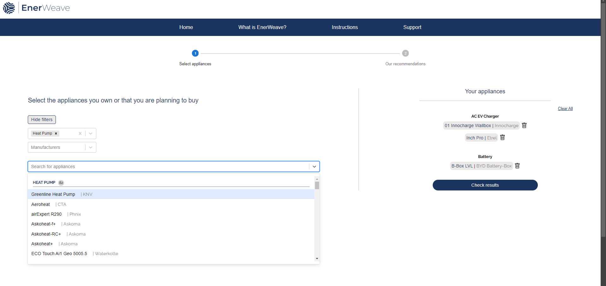
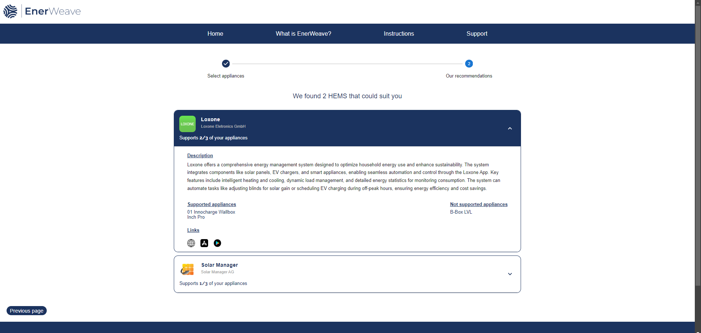

# enerweave

## About
As homes become increasingly equipped with solar panels, EV chargers, and smart devices, finding the right energy management system can feel overwhelming. That’s where EnerWeave steps in. 

Designed to make energy management simple and accessible, EnerWeave analyzes the devices in your home and identifies the best solution to bring them all together seamlessly. Whether it’s syncing solar panels with a battery system or integrating EV chargers and smart appliances, it finds the perfect match tailored to your setup.

Say goodbye to endless comparisons and juggling multiple apps. With EnerWeave, you’ll discover compatible systems that save you money, reduce energy waste, and make your home more sustainable, all in just a few clicks.

It isn’t just about technology, it’s about empowering homeowners to take charge of their energy future with confidence, efficiency, and ease!

EnerWeave has been developed in collaboration with Spine Energy, Business Information Systems students from Tampere University of Applied Sciences, and Business students from Hochschule München University of Applied Sciences.

## Pictures
### Home page

### Select applicances page
User can filter down the hardwares either with hardware category or manufacturer or user can directly search for applicances in the dropdown by typing.

### Results page
Recommended HEMS(s) are ordered with the most appliances supported top to bottom. Expandable card opens with detailed information about each HEMS and links to relevant sites.

